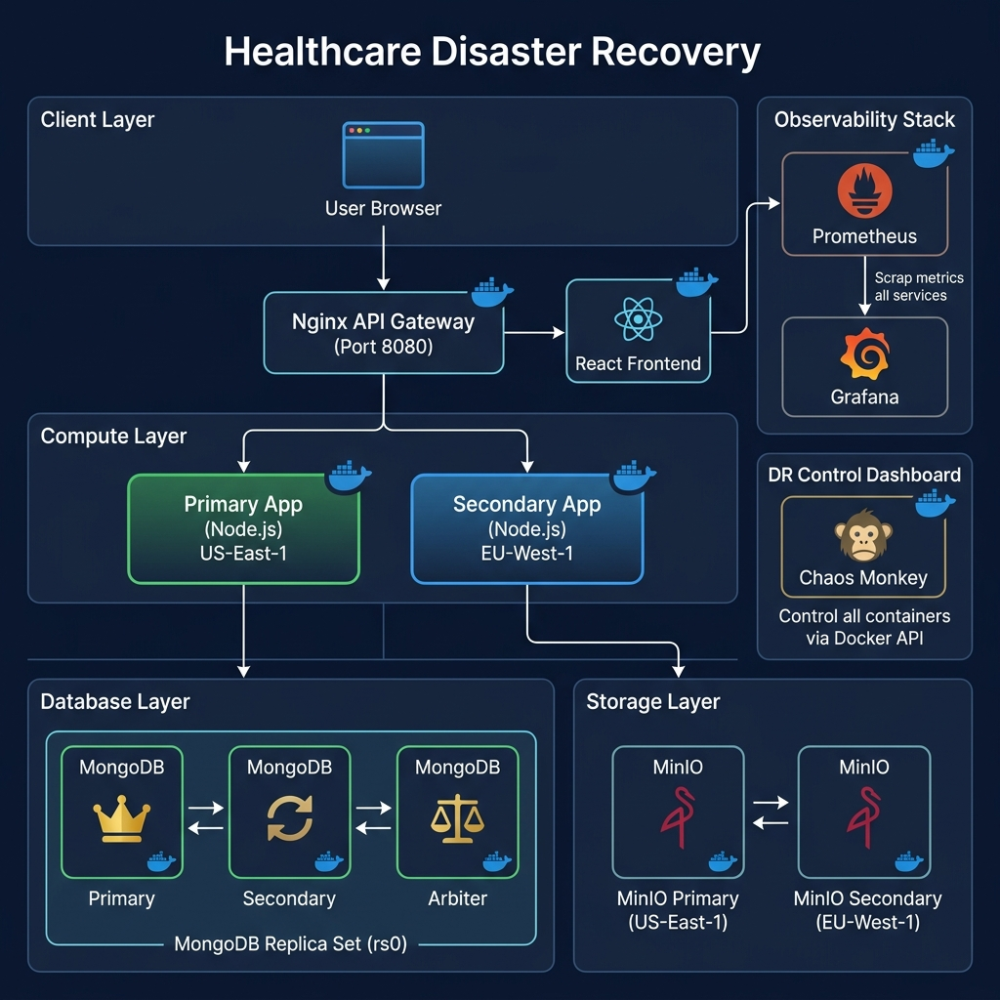
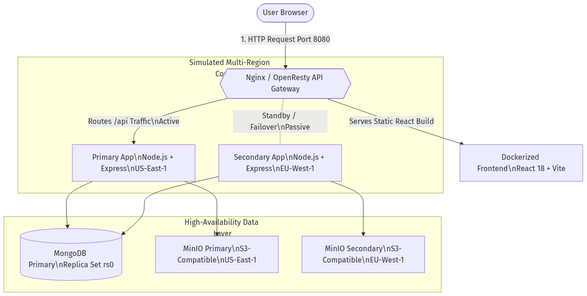
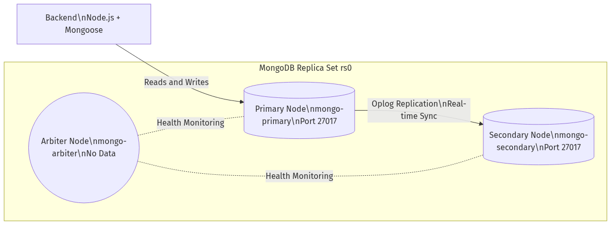
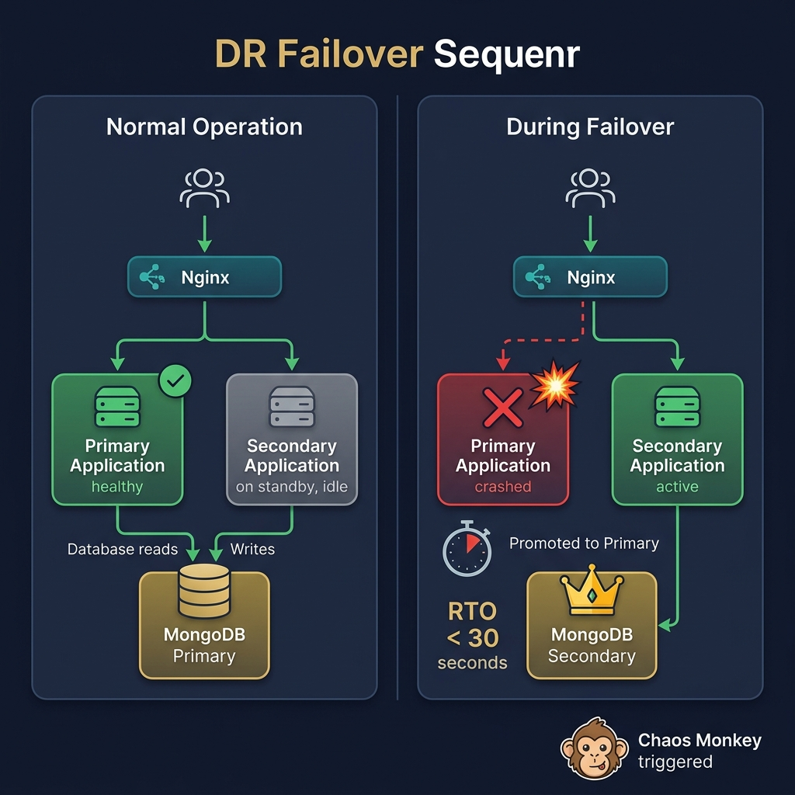
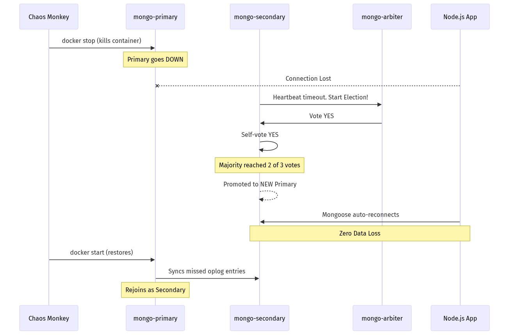
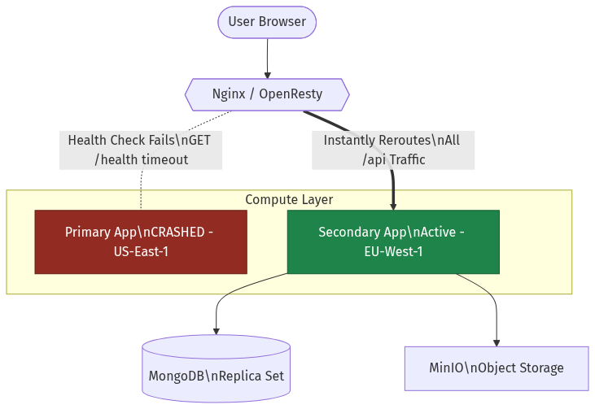
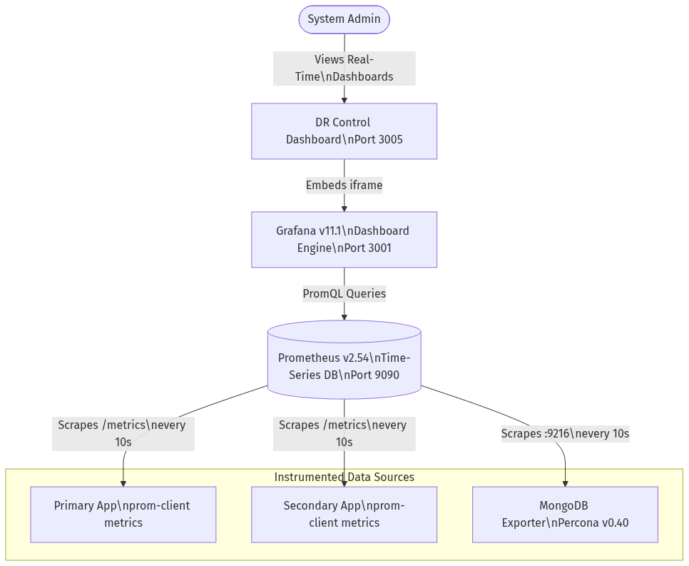
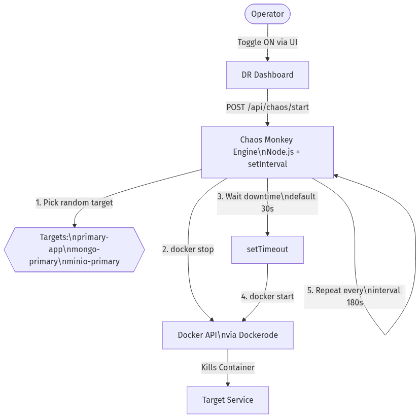
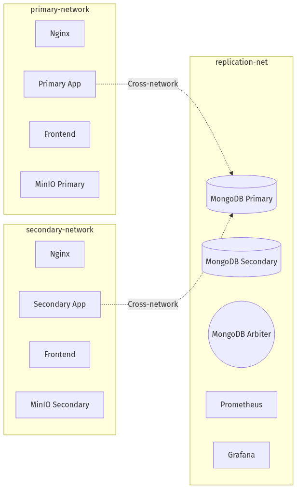

# 🏥 Visual Architecture & Disaster Recovery Breakdown

This document visually breaks down how traffic flows through the Healthcare Application and how the Disaster Recovery (DR) mechanisms automatically heal the system.

---

## 📐 Full System Architecture Overview

The following figure illustrates the complete system architecture, showing every containerized component and how they interconnect across the multi-region simulation.

---

## 1. 🚦 End-to-End Traffic Flow

When a doctor or patient uses the application, the traffic flows through a central load balancer (Nginx/OpenResty). Nginx acts as an **API Gateway**, serving the React UI directly from the `frontend-app` container and routing all data requests (`/api`) to the backend Node.js instances.

**Key points:**
- **Port 8080** is the single entry point for all users
- Nginx differentiates between UI requests (`/`) and API requests (`/api/*`)
- The **Active-Passive** model means only one backend handles traffic at a time
- Both apps connect to the same MongoDB Replica Set via the `replication-net` Docker network

---

## 2. 🗄️ Database Replication & Zero Data Loss

To prevent data loss if a database server crashes, MongoDB is deployed as a **3-node Replica Set**. All writes go to the Primary node, which instantly replicates the data to the Secondary. The Arbiter participates in elections but stores no data.

**Key points:**
- **Oplog Replication**: MongoDB uses an operations log to replay writes on the Secondary in real-time
- **Read Preference**: Apps use `secondaryPreferred`, allowing reads from the Secondary to reduce load on the Primary
- **Arbiter**: A lightweight process that exists solely to break ties during elections (no storage overhead)

---

## 3. 💥 Disaster Recovery: Database Failover (Automatic Election)

If the `mongo-primary` container is killed (by the Chaos Monkey or a real crash), the Node.js apps temporarily lose their database connection. Within **milliseconds**, the surviving nodes hold an automatic election, and the Secondary is promoted to become the new Primary.

**Recovery Timeline:**

| Phase | Duration |
|-------|----------|
| Failure detection (heartbeat timeout) | ~10 seconds |
| Election & promotion | < 1 second |
| App reconnection (Mongoose driver) | 2–5 seconds |
| **Total RTO** | **< 15 seconds** |

---

## 4. 🔀 Disaster Recovery: Application-Level Failover

If the entire `primary-app` container crashes, Nginx/OpenResty detects the failure via its built-in health checks and **instantly reroutes** all backend API traffic to the `secondary-app`. The user experience is uninterrupted — at most a single request may timeout.

**How Nginx detects failure:**
- OpenResty runs Lua-based active health checks every **10 seconds**
- After **3 consecutive failures** (30s), the primary upstream is marked as `down`
- Traffic automatically shifts to the secondary upstream
- When the primary recovers, Nginx gradually restores it to the active pool

---

## 5. 📊 The Observability Stack (Metrics & Monitoring)

How do you *prove* the DR is working? The observability stack continuously scrapes telemetry data from every container and presents it in real-time visual dashboards.

**Metrics collected include:**

| Category | Metrics |
|----------|---------|
| **Application** | HTTP request count, response latency (p50/p95/p99), active connections |
| **MongoDB** | Replica set member state, oplog window, operations/sec, connections |
| **Infrastructure** | Container up/down status, memory usage, CPU utilization |

---

## 6. 🐒 Chaos Engineering Loop (Chaos Monkey)

The Chaos Monkey is a custom Node.js script built into the DR Dashboard that automates resilience testing by randomly disrupting infrastructure.

---

## 7. 🌐 Docker Network Isolation

The DR environment uses **three isolated Docker networks** to simulate real multi-region network boundaries. This ensures services can only communicate with the components they're supposed to reach.

> **Note**: Nginx and Frontend exist on both `primary-network` and `secondary-network`, while all database/monitoring services share `replication-net`. Services like `primary-app` bridge across `primary-network` and `replication-net` to reach MongoDB.

---

*Last updated: April 2026*
